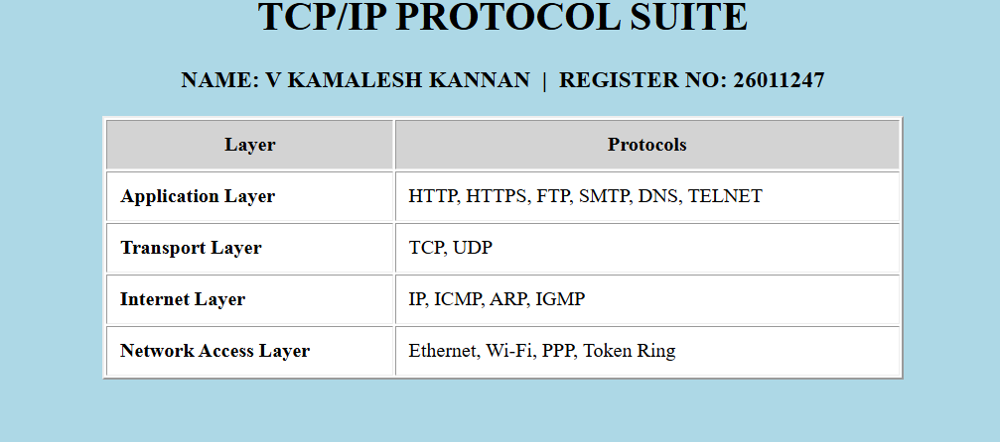

# EX01 Developing a Simple Webserver
## Date: 08-10-2026

## AIM:
To develop a simple webserver to serve html pages and display the list of protocols in TCP/IP Protocol Suite.

## DESIGN STEPS:
### Step 1: 
HTML content creation.

### Step 2:
Design of webserver workflow.

### Step 3:
Implementation using Python code.

### Step 4:
Import the necessary modules (`HTTPServer`, `BaseHTTPRequestHandler`).

### Step 5:
Define a custom request handler class to handle HTTP GET requests.

### Step 6:
Start an HTTP server on port 8000.

### Step 7:
Run the server and verify the output in the web browser at http://127.0.0.1:8000.

## PROGRAM:

<!DOCTYPE html>
<html>
<head>
    <title>TCP/IP Protocol Suite</title>
</head>
<body bgcolor="lightblue">
    <h1 align="center">TCP/IP PROTOCOL SUITE</h1>
    <h3 align="center">NAME: V KAMALESH KANNAN &nbsp;|&nbsp; REGISTER NO: 26011247</h3>
    <table border="2" align="center" width="75%" cellpadding="10" bgcolor="white">
        <tr bgcolor="lightgrey">
            <th>Layer</th>
            <th>Protocols</th>
        </tr>
        <tr>
            <td><b>Application Layer</b></td>
            <td>HTTP, HTTPS, FTP, SMTP, DNS, TELNET</td>
        </tr>
        <tr>
            <td><b>Transport Layer</b></td>
            <td>TCP, UDP</td>
        </tr>
        <tr>
            <td><b>Internet Layer</b></td>
            <td>IP, ICMP, ARP, IGMP</td>
        </tr>
        <tr>
            <td><b>Network Access Layer</b></td>
            <td>Ethernet, Wi-Fi, PPP, Token Ring</td>
        </tr>
    </table>
</body>
</html>"""

## OUTPUT:

## RESULT:
The program for implementing a simple webserver to serve html pages and display the list of protocols in TCP/IP Protocol Suite was executed successfully.
